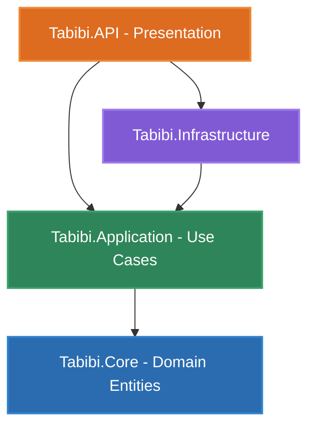
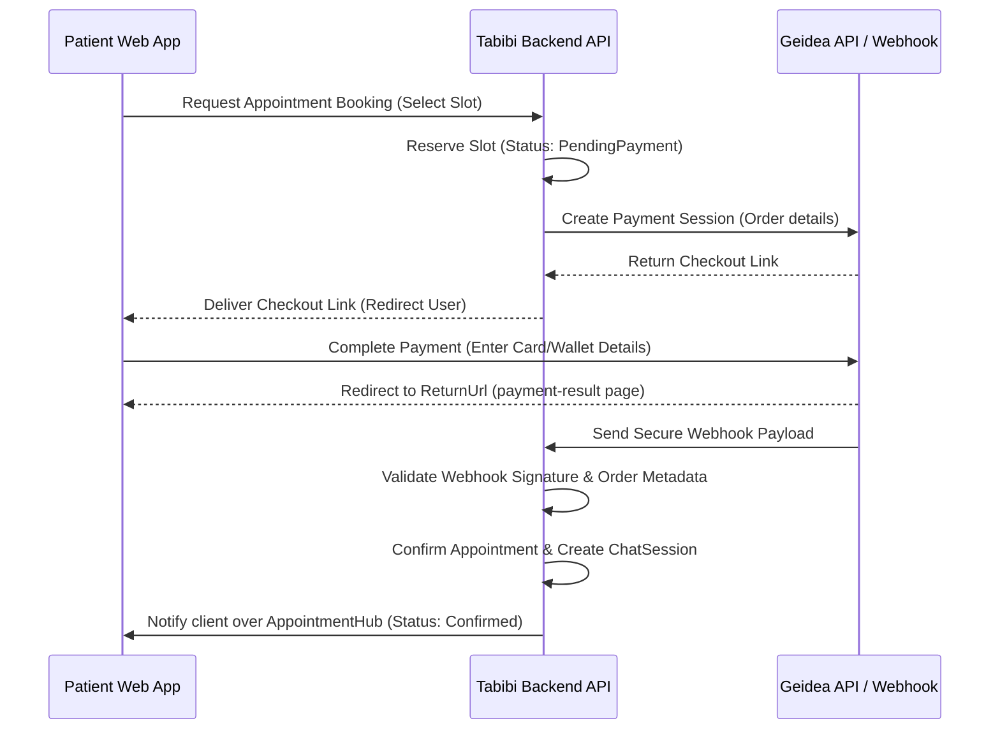

# Tabibi (طبيبي) — Comprehensive Telehealth Platform

Tabibi is a state-of-the-art, secure, and intuitive telehealth system designed to bridge the gap between patients and medical professionals. By combining the power of **Gemini Multimodal AI** for initial symptom triage and **WebRTC (PeerJS) + SignalR** for direct consultations, Tabibi ensures that medical intake is simple, diagnosis is collaborative, and payments are seamless.

---

## 🚀 Live Deployment
The application is deployed live and accessible via:
* **Frontend UI / Live Site**: [tabibi.dpdns.org](http://tabibi.dpdns.org)

---

## 🛠️ Technology Stack

Tabibi is built using modern, enterprise-ready technologies separated across a decoupled architecture:

### Frontend (Single Page Application)
* **Framework**: React 19 + Vite (for high-speed HMR and optimized builds)
* **Language**: TypeScript (strongly typed client state and models)
* **Styling**: Tailwind CSS v4 (providing sleek utility classes and premium design patterns)
* **Real-time Comms**: `@microsoft/signalr` (websocket connection management)
* **Video Consulting**: `peerjs` (WebRTC client wrapper for high-fidelity peer-to-peer audio/video calls)
* **Authentication**: Google OAuth integration (`@react-oauth/google`) & custom JWT handlers
* **UI Utilities**: SweetAlert2 (premium interactive modals) & React Toastify (non-blocking notifications)
* **Routing**: React Router DOM 7

### Backend (Clean Architecture / DDD)
* **Framework**: .NET 10.0 Web API (robust, scalable, and cross-platform)
* **ORM**: Entity Framework Core 10 (code-first migrations, UTC date tracking, and Fluent Configuration)
* **Relational Database**: Microsoft SQL Server
* **Security & Auth**: ASP.NET Core Identity with custom JSON Web Tokens (JWT)
* **AI Engine**: Google GenAI C# SDK (accessing Gemini 3.1 flash lite model)
* **File Storage**: Amazon S3-compatible Backblaze B2 Storage (isolated file upload and streaming reverse proxy)
* **Real-time Web Sockets**: ASP.NET Core SignalR (appointment updates, live text chats, and WebRTC signaling)
* **Payment Gateway**: Geidea Payment SDK (supporting cards, wallets, and instant webhook transaction verifications)

---

## 🏛️ Architecture & Project Structure

The backend follows the principles of **Clean Architecture** (Domain-Driven Design boundaries), isolating business logic from external frameworks, persistence mechanisms, and API endpoints.



### Backend Directory Layout
* **[Tabibi.Core](file:///c:/My%20Files/Tabibi/Backend/Tabibi.Core)**: Core domain entities. Contains no dependencies on databases or external frameworks.
  * `Models/`: Database objects (`AppUser`, `DoctorProfile`, `PatientProfile`, `Appointment`, `Payment`, `AiRecharge`, etc.).
* **[Tabibi.Application](file:///c:/My%20Files/Tabibi/Backend/Tabibi.Application)**: Interfaces, DTOs, business rules, and background tasks.
  * `Interfaces/`: Repository and Service contracts (`IAIDoctor`, `IAppointmentService`, `IPaymentService`, etc.).
  * `Services/`: Domain logic implementations (e.g. `AIDoctor`, `DoctorService`, `AuthService`).
  * `DTOs/`: Data Transfer Objects for API requests/responses.
* **[Tabibi.Infrastructure](file:///c:/My%20Files/Tabibi/Backend/Tabibi.Infrastructure)**: Implements database operations and integrates external SDKs.
  * `Data/`: Entity Framework Core `AppDbContext` and migrations.
  * `Repositories/`: Unit of Work and generic repository patterns.
  * `Services/`: Geidea payments implementation (`GeideaPaymentStrategy`), S3 file services, and SignalR presence systems.
* **[Tabibi.API](file:///c:/My%20Files/Tabibi/Backend/Tabibi.API)**: The web API layer.
  * `Controllers/`: Exposes REST endpoints (e.g., `AuthController`, `AIController`, `DoctorController`, `VideoCallController`).
  * `Hubs/`: SignalR hubs for text chat, video calling, and scheduler notifications.
  * `Middlewares/`: Global Exception Handler, Rate Limiting, and CORS configurations.

---

## 🌟 Key Features & Workflow

### 1. Empathetic AI Symptom Triage (Gemini AI)
* **Daily Free Quota**: Patients receive 15 free messages daily. Extra messages are rechargeable at a rate of **20 messages for 10 EGP**.
* **Multimodal Analysis**: Patients can upload pictures of injuries, dermatological concerns, or lab scans. The AI processes these images alongside the text descriptions.
* **Bilingual Interaction**: Responds in natural English or Modern Standard Arabic (MSA), depending on the user's input.
* **Intelligent Escalation**: Classifies concerns into *wellness suggestions*, *clarifications*, or *doctor escalations*. If escalated, it flags the severity (low, medium, high) and recommends the correct clinical department (e.g., Cardiology, Pediatrics, Dermatology).
* **Clinical Summaries**: In case of escalation, the AI automatically compiles a running clinical summary in Modern Standard Arabic (MSA). The human doctor receives this summary before the consultation, optimizing clinical efficiency.

### 2. Appointment Booking & Scheduler
* **Search & Filter**: Patients can search for doctors by department/specialty, city, price range, and patient rating.
* **Dynamic Calendar**: Doctors specify their availability in weekly time blocks. The platform generates individual consultation slots dynamically.
* **Geidea Checkout**: Appointments are booked upon successful payment authorization using the Geidea Payment gateway. 
* **Cancellation Policies**: Unpaid appointments are cleaned up by a backend background worker (`PendingAppointmentCleanupService`) if not paid within 15 minutes.

### 3. Consultation Delivery Channels
* **SignalR Real-Time Chat**: Live messaging directly in the web app, allowing doctors and patients to exchange advice and clinical records.
* **WebRTC Video Consultations**: Real-time peer-to-peer audio and video streaming powered by a custom SignalR signaling gateway and `peerjs`. High-definition video with in-call chat panels and mute/video toggle features.

### 4. Admin Verification & Doctor Security Log
* **Doctor Approvals**: Newly registered doctors cannot accept bookings until they submit verification materials (Medical License, National ID) and are approved by an administrator.
* **Critical Changes Lock**: If a doctor updates critical credentials (specialty, license number, national ID), the profile modifications are put in a pending review queue (`DoctorProfileChangeLog`). The doctor continues practicing under their old credentials until the administrator reviews and approves the updates.

---

## 💳 Payment Gateway Integration (Geidea)

Tabibi leverages **Geidea's Merchant APIs** to handle credit cards and mobile wallet transactions.



> [!IMPORTANT]
> To prevent race conditions from concurrent duplicate webhooks, the backend uses `Serializable` transaction isolation levels in Entity Framework Core when updating payment status.

---

## 📦 Database Schema Overview

The relational structure is centered around core clean domains:
* **Users & Roles**: `AppUser` inherits from `IdentityUser`, holding properties like `FullName` and user avatars. Standard roles are `Patient`, `Doctor`, and `Admin`.
* **Profiles**: `PatientProfile` stores clinical records; `DoctorProfile` holds qualifications, verification state, and biographical details.
* **Specialties**: List of 44 medical specialties seeded during startup.
* **Appointments & Availability**:
  * `DoctorAvailability`: Weekly recurrent schedules.
  * `Appointment`: Concrete sessions linking `PatientProfile`, `DoctorProfile`, and individual timeslots.
* **Chats & Video Consultations**:
  * `ChatSession` & `ChatMessage`: Persistent messaging logs.
  * `VideoCallSession`: Active video call details (e.g. participant connections, duration, and status).
* **Billing**:
  * `Payment`: Links payments directly to appointments.
  * `AiRecharge`: Tracks payments for replenishing AI messages.

---

## 🏃 Local Development Quickstart

### Prerequisites
* **Backend**: .NET 10.0 SDK + SQL Server (LocalDB or Express)
* **Frontend**: Node.js v18+ & npm

### Step 1: Initialize the Database
Run migrations from the `Backend` directory using the .NET CLI:
```bash
cd Backend
dotnet ef database update --project Tabibi.Infrastructure --startup-project Tabibi.API
```
*Note: Seeding scripts in `DataSeeder.cs` will run automatically on the first API boot to establish roles, pre-populate specialties, and register the default Admin user.*

### Step 2: Start the Backend Web API
Launch the REST backend (usually runs on `http://localhost:5222` / `https://localhost:7087` or as configured in `launchSettings.json`):
```bash
cd Backend/Tabibi.API
dotnet run
```

### Step 3: Launch the Frontend Development Server
Install dependencies and launch the Vite development server:
```bash
cd Frontend
npm install
npm run dev
```
Open [http://localhost:5173](http://localhost:5173) in your browser to interact with the application.

---

## 🔒 Security Practices & Optimizations
1. **Isolated Storage API**: Files stored in Backblaze B2 are not accessible via public urls. The backend acts as a streaming proxy (`FilesController.cs`), validating caller permissions and decrypting streaming resources.
2. **Double Webhook Checks**: Geidea payments are verified using HMAC SHA256 webhook signatures, and validated against stored order prices and currencies inside serializable db locks.
3. **Background Sanitizers**:
   * `TokenCleanupService` automatically prunes expired refresh tokens from database memory.
   * `PendingAppointmentCleanupService` clears slots reserved by patients who closed their browser during Geidea payment checkout.
4. **Endpoint Rate Limiting**: Armed with `AuthPolicy` rate limits on `/login` and `/register` to defeat credential stuffing attacks.
